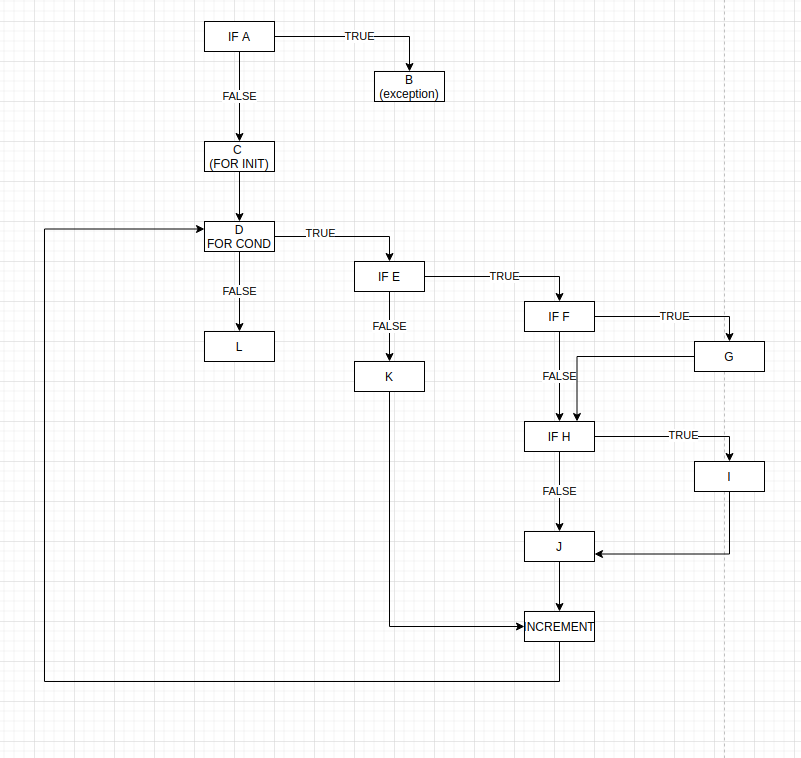

# Втора лабораториска вежба по Софтверско инженерство

## Александар Мицевски, бр. на индекс 171112

### Група на код: 

Ја добив групата на код 5

###  Control Flow Graph

Фотографија од control flow graph-ot

### Цикломатска комплексност

Цикломатската комплексност на овој код е 6, истата ја добив преку формулата P+1, каде што P е бројот на предикатни јазли. Во случајoв P=5, па цикломатската комплексност изнесува 2.

### Тест случаи според критериумот  Every statement 

....

### Тест случаи според критериумот Every path

.... 

### Објаснување на напишаните unit tests

...
...
